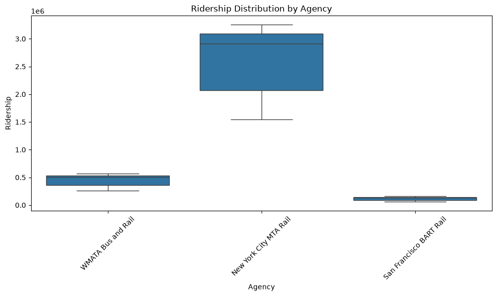
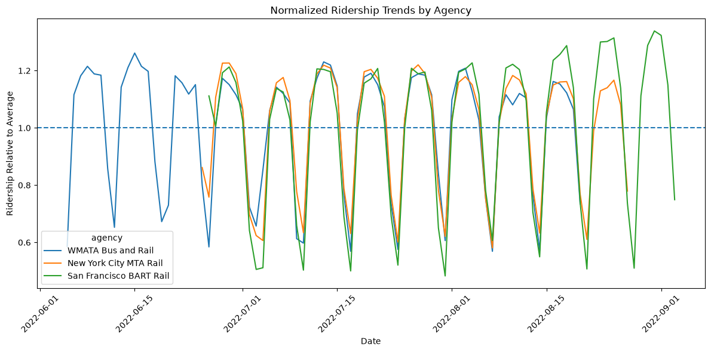

# Public Transportation Ridership Analysis

## Overview

This project analyzes public transportation ridership data from three major transit agencies using Python and data analysis techniques.

The goal was to clean raw transportation data, identify trends, and visualize differences in ridership patterns.

## Agencies Analyzed

- New York City MTA Rail
- WMATA Bus and Rail
- San Francisco BART Rail

## Tools Used

- Python
- Pandas
- NumPy
- Matplotlib
- Seaborn
- Jupyter Notebook

## Analysis Performed

### Data Cleaning

- Standardized column names
- Converted dates into datetime format
- Converted numerical data stored as text into numeric values
- Checked missing values and duplicates

### Exploratory Data Analysis

The project analyzed:

- Total ridership by agency
- Ridership trends over time
- Weekly ridership patterns
- Ridership variability
- Normalized ridership behavior

## Key Findings

- New York City MTA Rail had the highest overall ridership.
- All agencies showed lower ridership during weekends.
- Weekday commuting patterns strongly influenced transit usage.
- Agencies displayed different levels of ridership variability.

## Future Improvements

Possible extensions:

- Ridership forecasting models
- Weather correlation analysis
- Machine learning prediction models
- Additional transit systems

## Data Processing

The raw dataset was transformed into an analysis-ready dataset by:
- Cleaning and standardizing fields
- Creating date-based features
- Adding weekday/week number attributes
- Calculating normalized ridership values for agency comparison

The processed dataset is stored in:
`data/processed/transit_data_cleaned.csv`

## Visualizations

### Ridership Trends Over Time

### Agency Comparison

